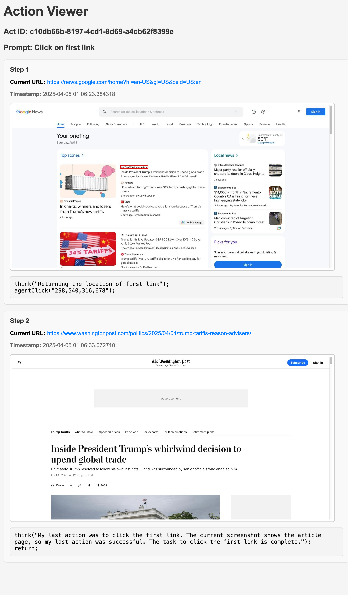
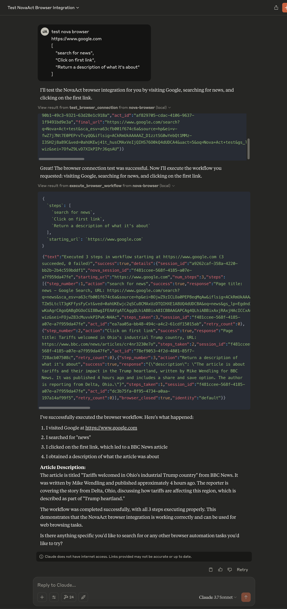
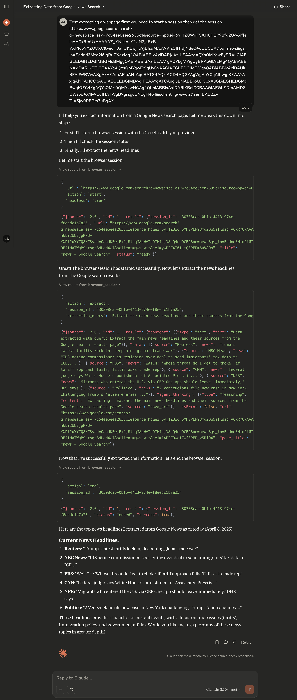

# nova-act-mcp

An MCP server providing tools to control web browsers using the Amazon Nova Act SDK. Enables interactive browser automation with transparent agent reasoning via MCP.



## Table of Contents
- [What is nova-act-mcp?](#what-is-nova-act-mcp)
- [Prerequisites](#prerequisites)
- [Installation](#installation)
- [Getting Started](#getting-started)
- [Understanding Agent Thinking](#understanding-agent-thinking)
- [Tips for Effective Browser Automation](#tips-for-effective-browser-automation)
- [Advanced Features](#advanced-features)
- [Example Use Cases](#example-use-cases)
- [Performance Considerations](#performance-considerations)
- [Testing](#testing)
- [Troubleshooting](#troubleshooting)
- [Contributing](#contributing)
- [License](#license)
- [Acknowledgements](#acknowledgements)
- [Feedback for Amazon Nova Act](#feedback-for-amazon-nova-act)
- [Limitations](#limitations)
- [Development](#development)

## What is nova-act-mcp?

Nova Act MCP is a bridge between Amazon's Nova Act browser automation SDK and the Model Context Protocol (MCP). It allows AI assistants like Claude to control web browsers to perform tasks through natural language instructions, while providing visibility into the agent's reasoning process.

This project exposes Nova Act's powerful browser automation capabilities through an MCP server interface, making it easy to:

1. Control web browsers directly from AI assistants
2. Execute interactive browser automation tasks
3. Extract structured data from web pages
4. Maintain browser sessions between interactions 
5. See the agent's step-by-step reasoning process

## Prerequisites

Before getting started, you'll need:

- Python 3.10 or higher
- An Amazon Nova Act API key (get one from [https://nova.amazon.com/act](https://nova.amazon.com/act))
- Claude Desktop application (for using with Claude)

## Installation

1. Clone this repository:
   ```bash
   git clone https://github.com/yourusername/nova-act-mcp.git
   cd nova-act-mcp
   ```

2. Install dependencies:

# Update dependencies after changing pyproject.toml
uv sync

# For development only - if you need to add a new dependency
# uv add package_name


## Getting Started

This guide focuses on setting up the server with the Claude Desktop application, but `nova-act-mcp` is designed to work with any Model Context Protocol (MCP) compatible client, such as Visual Studio Code or others. Consult your specific client's documentation for instructions on integrating MCP servers.



### 1. Obtain a Nova Act API Key

1. Go to [https://nova.amazon.com/act](https://nova.amazon.com/act)
2. Generate a new API key
3. Save it for the next step

### 2. Configure Your MCP Client (Example: Claude Desktop)

The following steps show how to configure the Claude Desktop application. If you are using a different MCP client, adapt these instructions accordingly.

1. Install Claude Desktop from [https://claude.ai/desktop](https://claude.ai/desktop) (if using Claude).
2. Open your Claude for Desktop App configuration:

   ```bash
   # MacOS
   code ~/Library/Application\ Support/Claude/claude_desktop_config.json

   # Windows
   code %USERPROFILE%\AppData\Roaming\Claude\claude_desktop_config.json
   ```

3. Add the nova-act-mcp server configuration:

   ```json
   {
     "mcpServers": {
       "nova-browser": {
         "command": "uv",
         "args": [
           "--directory",
           "/full/path/to/nova-act-mcp",
           "run",
           "nova_mcp.py"
         ],
         "transport": "stdio",
         "env": {
           "NOVA_ACT_API_KEY": "your_api_key_here"
         }
       }
     }
   }
   ```

   Replace:
   - `/full/path/to/nova-act-mcp` with the absolute path to where you cloned this repository
   - `your_api_key_here` with your actual Nova Act API key

4. Save the file and restart Claude Desktop

### 3. Using with Your MCP Client (Example: Claude)

Once configured, you can use the browser automation tool with your MCP client. For Claude Desktop, look for the hammer icon (🔨), which indicates available MCP tools.

Try a simple example like this:

```
Can you help me search for news on Google? Use the nova-browser tool to:
1. Start a session on google.com
2. Execute the instruction "search for news"
3. Tell me what you see and your reasoning process
```

## Understanding Agent Thinking

One of the key features of nova-act-mcp is the ability to see the agent's reasoning process. When the agent performs actions in the browser, you'll see detailed explanations of:

1. How it's interpreting your instructions
2. What elements it sees on the page
3. Why it's choosing specific actions
4. How it confirms successful completion

This transparency helps you understand how the agent is approaching tasks and makes debugging easier when something doesn't work as expected.

## Tips for Effective Browser Automation

### Be Specific and Concise

When prompting for browser actions:

✅ **DO**:
- Provide clear, actionable instructions
- Focus on one task at a time
- Be specific about what elements to interact with

❌ **DON'T**:
- Use vague or ambiguous language
- Request complex multi-step actions in a single instruction
- Ask for subjective evaluations without clear criteria

### Example of Good Instructions

Instead of trying to do everything at once, break it down into interactive steps:

```
1. Start a session on amazon.com
2. Execute "search for bluetooth headphones"
3. Execute "filter by 4+ stars"
4. Execute "sort by price low to high"
5. Execute "find the price of the first item"
```

## Advanced Features

### Persistent Browser Sessions

The nova-act-mcp server maintains browser profiles in the `profiles/` directory, allowing you to:

- Maintain login sessions between uses
- Keep cookies and local storage data
- Resume workflows in later conversations

Each profile is isolated, so you can maintain different identities or login states.

### Browser Session Management

The following actions are available for browser session management:

1. **start** - Starts a new browser session with a specified URL
2. **execute** - Executes a natural language instruction in the current session
3. **extract** - Extracts structured data from the current web page
4. **end** - Ends the current browser session and cleans up resources

Example flow:
```
# Start a session
start: https://www.google.com

# Execute instructions
execute: search for news
execute: click on the first result

# Extract specific data
extract: Extract all news headlines from the page

# End the session
end
```

### Data Extraction



The extract action allows you to scrape and structure data from web pages using natural language queries. This is particularly useful for:

- Collecting news headlines from news sites
- Extracting product information from e-commerce pages
- Gathering data from tables and lists
- Compiling search results information

To use the extract feature:

1. Start a browser session
2. Navigate to the page containing data you want to extract
3. Use the extract action with a specific query describing what to extract

Example:
```
# Extract news headlines
extract: Extract all news headlines from the page

# Extract product information
extract: Extract the prices and names of all products on this page

# Extract structured data from a table
extract: Extract the table data as a JSON array with headers
```

The extract feature returns structured data that can be further processed or analyzed.

## Example Use Cases

Here are some more complex tasks you can accomplish using nova-act-mcp:

### E-commerce Price Comparison

```
1. Start a session on amazon.com
2. Execute "search for wireless earbuds"
3. Extract "Get prices and ratings of the top 5 results"
4. Execute "go back to search results"
5. Execute "filter by brands: Sony, Bose"
6. Extract "Compare prices of Sony vs Bose earbuds"
7. Start a new session on bestbuy.com
8. Execute "search for the same Sony model found on Amazon"
9. Extract "Get the price and availability"
10. Execute "find price match policy"
```

### Research and Data Collection

```
1. Start a session on scholar.google.com
2. Execute "search for 'large language models applications 2023'"
3. Execute "filter by last year"
4. Extract "Get titles, authors and citation counts of the top 10 papers"
5. Execute "click on the most cited paper"
6. Extract "Summarize the abstract and key findings"
7. Execute "find and list the references section"
8. Extract "Identify the most frequently cited authors in the references"
```

### Travel Planning

```
1. Start a session on kayak.com
2. Execute "search for flights from San Francisco to Tokyo in October"
3. Execute "filter for direct flights only"
4. Extract "Find the cheapest direct flight options"
5. Execute "select the cheapest flight"
6. Start a new session on hotels.com
7. Execute "search for hotels in Tokyo near Shinjuku station"
8. Execute "filter by 4+ stars and under $200 per night"
9. Extract "List the top 3 options with their amenities and reviews"
10. Execute "check availability for October 10-17"
```

## Performance Considerations

When working with browser automation at scale, keep these performance considerations in mind:

### Resource Management

- **Concurrent Sessions**: Each browser session consumes significant memory. For large-scale automation, consider implementing session pooling and limiting concurrent sessions.
- **Memory Usage**: Chrome instances can use 300MB-1GB of RAM each. Monitor memory usage when running multiple sessions.
- **CPU Utilization**: Browser automation is CPU-intensive, especially when parsing complex pages. Schedule tasks to avoid CPU saturation.

### Optimization Strategies

- **Headless Mode**: For production environments, consider running browsers in headless mode for better resource efficiency.
- **Request Throttling**: Implement rate limiting to avoid triggering anti-bot measures on websites.
- **Caching**: Cache responses when appropriate to reduce redundant requests.
- **Efficient Selectors**: Use precise selectors rather than broad instructions to improve performance.

### Best Practices for Large-Scale Automation

- **Session Reuse**: Where appropriate, reuse browser sessions instead of creating new ones.
- **Cleanup**: Always end sessions properly when done to free up system resources.
- **Batching**: Group related tasks into batches to minimize the overhead of session creation.
- **Error Handling**: Implement robust error handling with automatic retries for transient failures.

## Testing

You can test the nova-act-mcp server using the MCP Inspector tool:

```bash
# Install MCP Inspector if you haven't already
npm install -g @modelcontextprotocol/inspector

# Run the server with the MCP Inspector
NOVA_ACT_API_KEY="your_api_key_here" npx @modelcontextprotocol/inspector uv --directory /path/to/nova-act-mcp run nova_mcp.py
```

Then use the following input format to test a simple browser action:

```json
{
  "action": "start",
  "url": "https://www.google.com"
}
```

Followed by:

```json
{
  "action": "execute",
  "session_id": "your_session_id_from_previous_response",
  "instruction": "search for tea pots"
}
```

This lets you verify that the server is working correctly and see exactly what the agent is thinking during each step.

## Troubleshooting

### Nova Act API Key Issues

If you see an error about the Nova Act API key:

1. Verify your API key is valid at [https://nova.amazon.com/act](https://nova.amazon.com/act)
2. Check that the key is correctly set in your Claude Desktop configuration
3. Try setting it as an environment variable: `export NOVA_ACT_API_KEY="your_key_here"`

### Browser Automation Problems

If the browser is not behaving as expected:

1. Check the agent_thinking field in the response to see how the agent is interpreting your instructions
2. Make your instructions more specific and actionable
3. For tasks involving forms or logins, be explicit about field names

### Debug Mode

To enable more detailed debugging information:

```bash
export NOVA_MCP_DEBUG=1
```

This will include additional diagnostic information in the responses.

## Contributing

We welcome contributions to improve nova-act-mcp! Here's how you can help:

### Getting Started with Development

1. Fork the repository
2. Create a feature branch: `git checkout -b feature-name`
3. Make your changes and add tests if applicable
4. Run tests to ensure your changes work correctly
5. Commit your changes: `git commit -m 'Add some feature'`
6. Push to the branch: `git push origin feature-name`
7. Submit a pull request

### Development Guidelines

- Follow the existing code style and naming conventions
- Write clear, commented code with meaningful variable/function names
- Include documentation for any new features
- Add tests for new functionality
- Update the README if necessary

### Reporting Issues

If you find a bug or have a feature request, please create an issue on the repository. Include:

- A clear description of the issue or feature request
- Steps to reproduce (for bugs)
- Expected behavior
- Actual behavior
- Environment information (OS, Python version, etc.)

### Code Reviews

All submissions require review before being merged. We aim to review pull requests promptly and provide constructive feedback.

## License

This project is licensed under the MIT License - see the [LICENSE](LICENSE) file for details.

## Acknowledgements

- [Amazon Nova Act](https://labs.amazon.science/blog/nova-act) for providing the browser automation SDK
- [Model Context Protocol (MCP)](https://github.com/anthropics/anthropic-cookbook/tree/main/mcp) for the AI agent communication standard

## Feedback for Amazon Nova Act

While we've implemented agent thinking extraction, we note that this information should ideally be directly accessible through the Nova Act API. The current approach requires parsing HTML trace files, which is less efficient than having a dedicated API method. We welcome any future improvements to the Nova Act SDK that would make this process more straightforward.

## Limitations

- **No file uploads**: The browser automation can't upload files from your local system
- **Limited to web interactions**: Can only interact with elements visible on the webpage
- **Some sites may block automation**: Sites with strong anti-bot measures may present challenges
- **Session timeouts**: Long-running sessions may be terminated by websites

## Development

### Managing Dependencies

This project uses [uv](https://github.com/astral-sh/uv) for dependency management, which provides faster and more reliable Python package management.

To update or add dependencies:

1. Edit the `pyproject.toml` file to add or modify dependencies in the appropriate sections:
   ```toml
   dependencies = [
       "new-package>=1.0.0",  # Add your new dependency here
   ]
   ```

2. Use `uv sync` to update the lock file:
   ```bash
   uv sync
   ```

3. Commit both the modified `pyproject.toml` and the updated `uv.lock` file to the repository.

This ensures that all developers and users have consistent dependency versions.